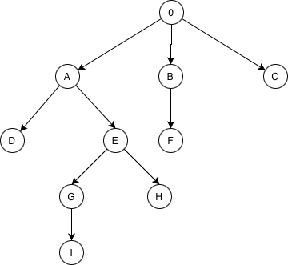
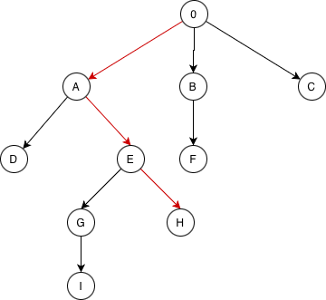

# Формирование массива идентификаторов объектов, являющихся предками заданного объекта
--------------------------------------------------------------------------------------

Данное решение запускает Docker-контейнер с базой PostgreSQL, инициализирует базу, создает 
индексы для быстрого поиска, заполняет базу тестовыми данными. Структура тестового дерева:

* Текущее решение работает с таблицами, содержащими колонку в JSONB-формате;
* Структура базы данных содержит одну таблицу;
* Переменные с именем пользователя, паролем и названием базы вынесены в .env файл;
* Добавлен .gitignore файл для отслеживания системных файлов и других, которые не должны попасть в git-репозиторий